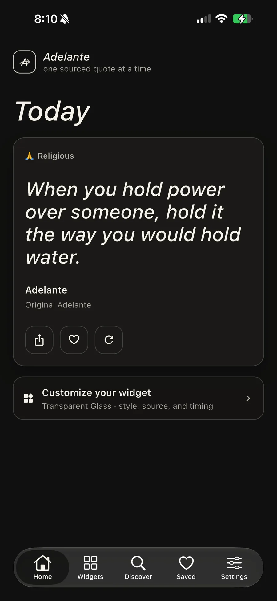
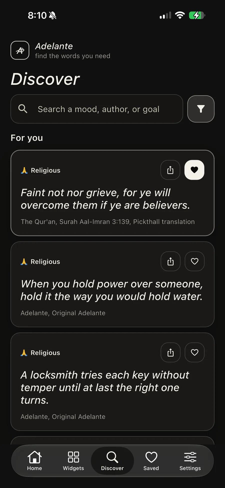
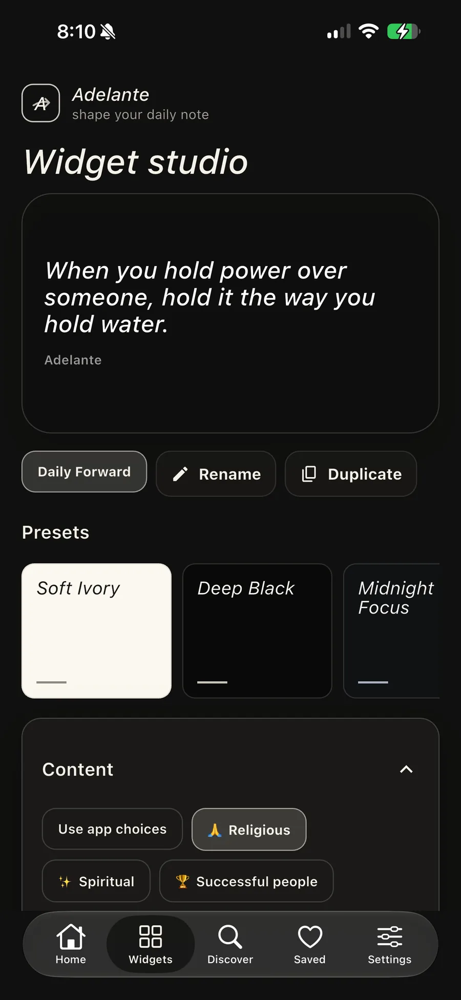

# Adelante

**A little encouragement, right where you’ll see it.**

Adelante is a Flutter motivation app whose main surface is the widget: on the Home Screen, Lock Screen and StandBy. Choose the subjects and sources that matter to you, then shape the typography, colour and layout around your day.

**In development for iOS and Android.** This repository is the public product and engineering showcase; application source is private.

[Read the case study](https://yeegz.github.io/work/adelante/) · [Architecture](docs/ARCHITECTURE.md) · [About the developer](https://yeegz.github.io)

  
  
  

Actual development captures used in the portfolio case study. [Saved quotations](assets/screens/saved.webp).

## Designed around the widget

- **Native surfaces:** WidgetKit and SwiftUI on iOS, Kotlin and RemoteViews on Android.
- **A widget studio:** preview the layout while choosing fonts, colours, content and refresh timing.
- **Offline content:** keep a local library and a shared widget payload so a widget can render without a live request.
- **Source-aware reading:** attribution travels with quotations into favourites, sharing and widgets.
- **Personal choice:** categories and explicit content preferences shape what appears.
- **Local preferences:** the product is designed without accounts, analytics or ads.

## The engineering problem

A Flutter screen, an iOS extension and an Android widget run in separate environments. They need to agree on the quote and remain useful offline. I built the app, both native widget systems, the shared payload and deterministic content preparation around that constraint.

| Part | Tools |
| :--- | :--- |
| App and widget studio | Flutter / Dart |
| iOS widgets | SwiftUI / WidgetKit |
| Android widgets | Kotlin / RemoteViews |
| Content preparation | TypeScript, Firebase and deterministic filtering |
| Local behaviour | Cached content, shared payloads and source-preserving preferences |

The [case study](https://yeegz.github.io/work/adelante/) documents the verified development snapshot, native integration, content library and test scope. It distinguishes completed implementation from release work still in progress.

## My contribution

Designed and built by **Yousof Selim**: product design, Flutter app, native widgets, content preparation and verification.

[Explore my other work](https://yeegz.github.io/work/) · [Discuss a project](mailto:yousofselim2@gmail.com)
