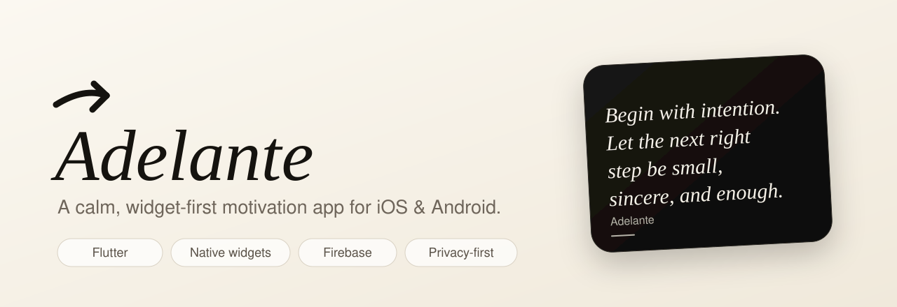
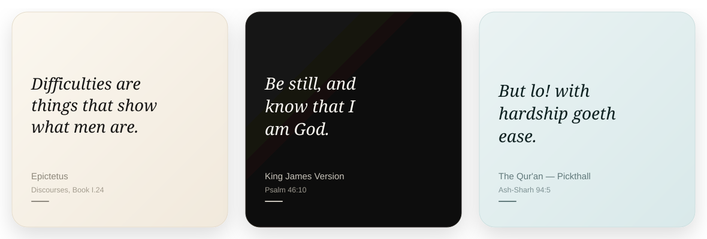
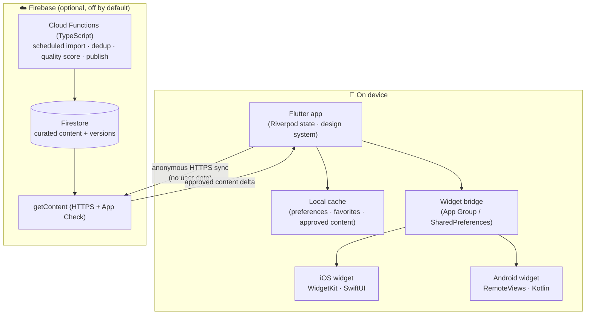

  

<h1 align="center">Adelante</h1>

  <em>A calm, widget-first motivation app for iOS &amp; Android.</em> 
  Beautiful, deeply customizable Home / Lock-Screen widgets — with the exact kind of words you asked for.

  
  
  
  
  
  

<blockquote align="center">
  <strong>Note:</strong> This is a showcase repository — it presents the product, design, and engineering.
  The application source is private.
</blockquote>

---

## Overview

**Adelante** (Spanish for *"go forward"*) is a cross-platform motivation app whose main product isn't a
feed or a dashboard — it's the **widgets**. The app exists to configure, personalize, and refresh the
motivational content that lives beautifully on your Home Screen, Lock Screen, and StandBy.

It's built to feel **soft, relaxing, premium, and intentional** — and to respect you: **no account, no
tracking, no ads**, with every preference (including faith) stored on-device.

  

---

## Highlights

- 🧩 **Two native widget implementations, one shared brain** — iOS **WidgetKit** (SwiftUI) and Android
  **RemoteViews** (Kotlin), driven from a single Flutter state + bridge layer, with visual parity across
  gradients, alignment, and smart text fitting.
- 🔤 **User-selectable fonts on the actual widgets** — a genuinely hard platform problem, solved on both
  sides (bundled into the iOS widget *extension* and resolved by PostScript name; per-font baked layout
  variants on Android, since RemoteViews can't swap a typeface at runtime).
- ☁️ **Self-updating content backend** — Firebase Firestore + scheduled **Cloud Functions** that import,
  de-duplicate, quality-score, and version content, protected by **App Check**; the app syncs over HTTPS
  and caches on-device so **widgets never make a live network call**.
- 🎯 **Strict, respectful content filtering** — pick a specific faith and you *only* ever see that
  tradition, with real sources and citations — never invented scripture.
- 🎨 **A real widget studio** — live preview, curated color pickers, fonts, layout, refresh cadence, and
  save-your-own presets.
- 🔒 **Private by design** — local-first preferences, zero analytics/ad SDKs, and a clean privacy story
  ready for App Store & Google Play submission.

---

## Features

### Widgets (the core product)
- iOS **Home Screen, Lock Screen (accessory), StandBy**, and iPad **extra-large** families.
- Android resizable **Home Screen** widgets.
- **Smart text fit** — quotes shrink and re-wrap to fit small widgets instead of clipping.
- Clean by default: quote + optional author/source/date, no debug-looking labels.
- Rotates through eligible content on your chosen cadence, and always **matches the in-app card**.

### Personalization
- Soft, multi-select **category onboarding** (Stoic, Study, Gym, Calm, Gratitude, Faith, and more).
- A **faith follow-up** with strict, single-tradition filtering.
- **Widget studio**: presets, fonts, colors, corners, alignment, metadata toggles, refresh timing,
  per-widget naming, and custom presets.

### Content
- A curated, **license-safe** launch library: public-domain scripture with exact citations
  (KJV, Pickthall Qur'an, JPS Tanakh, Dhammapada, Bhagavad-Gita), documented public-domain figures,
  and original Adelante writing.
- A backend pipeline designed to grow the library safely from **allow-listed sources only**.

### Experience
- Warm, soft light + dark themes; genuine frosted-glass navigation.
- Swipe between sections; calm, purposeful motion with a reduced-motion setting.
- Share a quote as a beautifully styled card.

---

## Architecture

**Design principle:** the app is fully functional **offline** from its bundled library; the cloud only
adds a self-updating, curated content stream — and never receives user data.

See [`docs/ARCHITECTURE.md`](docs/ARCHITECTURE.md) for the deep dive.

---

## Tech stack

| Layer | Technology |
| --- | --- |
| App | **Flutter / Dart**, Riverpod, a custom design-token + typography system |
| iOS widget | **Swift**, WidgetKit, SwiftUI (Home / Lock Screen / StandBy) |
| Android widget | **Kotlin**, App Widgets / RemoteViews, Canvas rendering |
| Backend | **Firebase** — Firestore, Cloud Functions (**TypeScript**), Cloud Scheduler, App Check |
| Quality | ~80 automated tests, `flutter analyze` clean, real-device iOS + Android builds |
| Tooling | Custom scripts for icon generation, font bundling, and content export |

---

## Engineering notes

A few problems that were more interesting than they look:

- **Custom fonts inside a WidgetKit extension.** Fonts bundled in the main app aren't available to the
  widget extension (separate bundle). They had to be added to the *extension* target and referenced by
  exact **PostScript name** — the family name silently falls back. Automated with a project script.
- **Fonts on Android RemoteViews.** RemoteViews can't set a typeface at runtime, so each font is its own
  baked-in layout variant selected by token — the reliable pattern.
- **Text that never clips.** iOS uses a `ViewThatFits` size ladder; Android uses XML uniform auto-size
  (and *not* a runtime text-size call, which silently disables it).
- **Widget ↔ app consistency.** The widget mirrors exactly what the app last published, as one source of
  truth — no independent drift.
- **Correct-by-construction content filtering**, guaranteed by tests: a specific-faith selection can never
  surface another tradition.

---

## Status

- ✅ Built and running on real **iOS and Android** hardware.
- ✅ App icons, launch screens, privacy policy, and store metadata prepared.
- 🚧 **Store-submission-ready** — not yet published to the App Store / Google Play.

---

## About

Designed and built end-to-end (product, design, Flutter app, both native widgets, and backend) by
**Yousof Selim**.

> *Adelante* means go forward.
